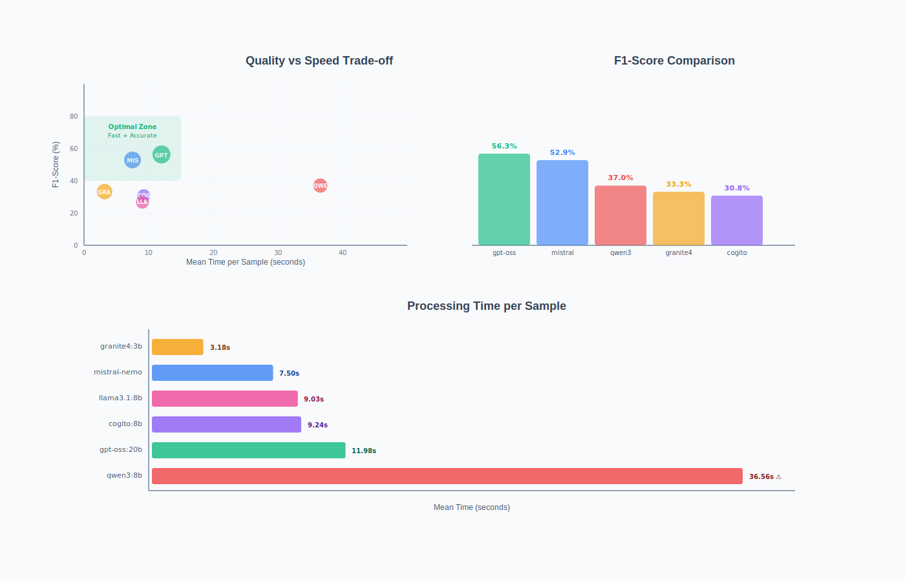

# xml_AI_agent — LLM-Based Geographic Extraction from SRA XML

## Context

**Virome@tlas** is a global cloud platform dedicated to viral surveillance. It integrates large-scale sequencing datasets with geographic metadata to better understand virus diversity, host ecology, and environmental context. A key component of the pipeline is the extraction of precise geographic locations from SRA BioSample XML files.

Although SRA metadata often contains potentially valuable location information, it is frequently **incomplete, inconsistent, or embedded in unstructured text**. This project proposes a fully automated, agent-based pipeline to extract, validate, normalize, and geocode geographic information from raw BioSample XML data.

Project page:
[https://www.shape-med-lyon.fr/projets/structurants-vague-1/virometlas/](https://www.shape-med-lyon.fr/projets/structurants-vague-1/virometlas/)

Poster (JOBIM):
[https://nextcloud.inrae.fr/s/oJe89krwM5GGoRw?dir=/&editing=false&openfile=true](https://nextcloud.inrae.fr/s/oJe89krwM5GGoRw?dir=/&editing=false&openfile=true)


## The Problem

SRA BioSample XML metadata presents several challenges:

* **Inconsistent geographic formats**

  * `"USA: Oregon"`
  * `"40° 12' 10'' N 72° W"`
  * `"32.167 N 64.50 W"`

* **Missing or incorrect fields**

  * `"NA"`
  * Latitude/longitude stored in incorrect attributes

* **Geographic information embedded in unstructured text**

  * `"Collected near Lake George, Uganda during expedition..."`

* **Institutions used as location proxies**

  * `"University of California, Davis"`

* **Complex biological metadata mixed with geographic data**

* **Population codes instead of locations**

  * `"CEU"`, `"TSI"`, etc.

Classical rule-based or regex-based approaches fail to robustly handle this diversity.
**Large Language Models (LLMs), however, can reason over context and ambiguity.**

This work explores the use of LLMs to automatically extract geographic information from XML metadata as a proof of concept.


## Initial Experiments

### Test #1 – Small Language Model (SLM)

**Objective**
Automatically extract geographic information from BioSample XML blocks.

**Model**

* TinyLlama (1.1B parameters)

**Technology**

* Python
* HuggingFace CLI
* Transformers
* GPU A30 (PRABI server)

**Approach**

* Large XML file split into individual `<BioSample>` blocks
* Each block processed independently by the model
* Results written to a CSV file

**Prompt**

```
Extract the most accurate geographic location information from this XML block
(latitude and longitude or region or country for instance).
Return ONLY the location string with no additional text.
If the location is not possible write "NA".

XML Block:
{block_text}
```

**Results**

* Average inference time: ~1.2 s per sample
* Output examples showed irrelevant or meta-level answers, e.g. explanations of the task itself

**Conclusion**
- Responses were mostly irrelevant
- Model unable to reliably extract geographic information


### Test #2 – Larger LLM via HuggingFace

**Motivation**

* Improve reasoning and extraction quality

**Issue**

* Poor RAM management
* Complex setup for a proof-of-concept

❌ Experiment discontinued to use an other AI "backend". 

### Test #3 – Larger LLM via Ollama

**Model**

* Gemma 3:4B

**Successes**

* Geographic information could be extracted
* Prompt engineering significantly improved results

**Failures**

* Overly verbose outputs
* Mixed formats (coordinates, cities, countries, ot both)
* Occasional hallucinations

Examples of problematic outputs:

* `"Jurkat, clone E6-1 T lymphocyte"`
* `"Yoruba in Ibadan, Nigeria"`
* `"Central North Pacific Subtropical Gyre, Station ALOHA, 75m depth"`
 
## New Approach: LLM Agent

To address verbosity, hallucinations, and formatting issues, a **tool-augmented LLM agent** was introduced.

### What is an LLM Agent?

An LLM agent is not limited to text generation. It can:

* Decide when to call external tools
* Execute functions (e.g. Python scripts)
* Query APIs (e.g. geocoding services)
* Combine reasoning with structured validation


## Solution: Agentic LLM-Based Geographic Extraction

This project uses a **local LLM as an agent** to extract and normalize geographic information from BioSample XML blocks.
The agent interacts with two executable tools.


### 🔧 Tool 1: `check_coordinate(coord)`

**Purpose**
Validate whether a string corresponds to valid decimal latitude/longitude coordinates.

**Behavior**

* Checks format: `"lat, lon"`
* Ensures values fall within valid geographic ranges
* Returns structured coordinates if valid, otherwise `"NA"`

### 🌍 Tool 2: `get_coordinate(place)`

**Purpose**
Convert a place name (city, region, country, institution, landmark) into decimal coordinates.

**Method**

* Uses the Nominatim geocoding service
* Returns structured coordinates if found, otherwise `"NA"`

## Agent Architecture


### Key Capabilities

* Extract the **most specific geographic entity** available
  (city > region > country)
* Validate coordinate formats
* Convert place names into canonical decimal coordinates
* Enforce **strict JSON output**
* Process each BioSample independently in a subprocess
  → improved stability and parallelism


## Supported XML Patterns

Examples of handled cases include:

* Coordinates in mixed formats
* Combined latitude/longitude fields
* Geographic names
* Institutions or landmarks
* Missing or malformed fields

---

## 🚀 Quick Start

### 1. Install Ollama

```bash
curl -fsSL https://ollama.ai/install.sh | sh
```

### 2. Pull models

```bash
ollama pull llama3.1:8b
ollama pull gpt-oss:20b
ollama pull mistral-nemo:12b
```

### 3. Create environment

```bash
python3 -m venv venv
source venv/bin/activate
pip install -r requirements.txt
```

### 4. Run extraction

```bash
python script/llm_agent_api.py \
  --input data_test/Dataset_test_biosample.xml \
  --model gpt-oss:20b \
  --output biosample_gptoss.csv
```


## Output Format

| Column           | Description                      |
| ---------------- | -------------------------------- |
| `accession`      | SRA BioSample accession          |
| `model`          | LLM used                         |
| `latitude`       | Decimal latitude (if available)  |
| `longitude`      | Decimal longitude (if available) |
| `place`          | Most specific extracted place    |
| `execution_time` | Runtime per XML block            |


## 🧪 Evaluation Pipeline

A dedicated evaluation script benchmarks multiple models against a manually curated ground truth file:
`xml_AI_agent/data_test/Dataset_test_biosample_answer.tsv` 

Example: 
```
SAMN21498129	Jinan University	23.0195072,113.4100461
SAMN14327956	University of Michigan Clinical Sequencing Exploratory Research (CSER)	42.27756,-83.74088
SAMN38737700	Genomic Analysis Laboratory, HHMI-Salk-Institute	32.887025,-117.245792
SAMN08032533	Lake George near Hamukungu	0.0169184,30.0861224
SAMN02688369	University of California Davis, CA 95616, U.S.A.	38.5402589,-121.7473923
SAMEA7280954	Nyons	44.3611931,5.1408743

```

### Run evaluation

```bash
python batch_llm_eval.py
```

---

## 📊 Benchmark Results

 

### Quality Metrics Comparison 
| Model | Accuracy | Precision | Recall | F1-Score | Specificity | 
|--------------------|----------|-----------|--------|----------|-------------|
 | **gpt-oss:20b** | 53.3% | **81.8%** | 42.9% | **56.3%**| **77.8%** | 
 | **mistral-nemo:12b**| 46.7% | 52.9% | **52.9%**| 52.9% | 38.5% |
  | **qwen3:8b** | 43.3% | **100.0%**| 22.7% | 37.0% | **100.0%** |
  | **cogito:8b** | 40.0% | **100.0%**| 18.2% | 30.8% | **100.0%** |
  | **granite4:3b** | 33.3% | 35.7% | 31.3% | 33.3% | 35.7% | 
 | **llama3.1:8b** | 26.7% | 25.0% | 28.6% | 26.7% | 25.0% | 
 
 #### Confusion Matrix Summary 
 | Model | TP | TN | FP | FN | 
 |--------------------|----|----|----|----|
  | **gpt-oss:20b** | 9 | 7 | 2 | 12 | 
 | **mistral-nemo:12b**| 9 | 5 | 8 | 8 |
  | **qwen3:8b** | 5 | 8 | 0 | 17 | 
 | **cogito:8b** | 4 | 8 | 0 | 18 | 
 | **granite4:3b** | 5 | 5 | 9 | 11 | 
 | **llama3.1:8b** | 4 | 4 | 12 | 10 |
 
  **Legend:** TP = True Positives, TN = True Negatives, FP = False Positives, FN = False Negatives


### Performance Metrics 
| Model | Mean Time (s) | Median Time (s) | P95 Time (s) | Total Time (s) |
 |--------------------|---------------|-----------------|--------------|----------------| 
 | **granite4:3b** | **3.18** | **2.90** | **4.40** | **95.4** |
  | **mistral-nemo:12b**| 7.50 | 6.87 | 9.99 | 224.8 | 
  | **llama3.1:8b** | 9.03 | 4.80 | 13.62 | 270.9 | 
  | **cogito:8b** | 9.24 | 8.36 | 14.37 | 277.1 |
   | **gpt-oss:20b** | 11.98 | 9.42 | 24.05 | 359.3 | | **qwen3:8b** | 36.56 | 32.46 | 60.03 | 1096.9 | 
  
  ### Key Findings 
  **🏆 Best Overall Model: gpt-oss:20b** 
  - Highest F1-score (56.3%) and accuracy (53.3%) 
  - Excellent precision (81.8%) with acceptable recall 
  - Moderate processing speed (~12s per sample) 
  
  **⚡ Fastest Model: granite4:3b** 
  - 3.18s average per sample (3.8x faster than gpt-oss) 
  - Trade-off: Lower accuracy (33.3%) 
  
  **🎯 Most Conservative: qwen3:8b & cogito:8b** 
  - Perfect precision (100%) but very low recall (<23%) 
  - Avoid false positives but miss many valid locations 

  **⚠️ Timeout Issues: qwen3:8b** - 9 timeouts out of 30 samples - Slowest overall (36.6s average) 

## Benchmark with Alternative Approaches 

 

### GLiNER (Zero-shot NER)

python script/run_with_gliner.py --input data_test/Dataset_test_biosample.xml


**Results:** 
- **Accuracy:** 33.3% 
- **Precision:** 66.7% 
- **Recall:** 18.2% 
- **F1-Score:** 28.6% 
- **Speed:** 0.75s per sample (16x faster than gpt-oss) 
- **Success rate:** 6/30 samples geolocalized 

### spaCy (Transformer-based NER)

bash
python script/run_with_spacy.py --input data_test/Dataset_test_biosample.xml

**Results:** 
- **Accuracy:** 33.3% 
- **Precision:** 50.0% 
- **Recall:** 20.0% 
- **F1-Score:** 28.6% 
- **Speed:** 0.58s per sample (20x faster than gpt-oss)
- **Success rate:** 8/30 samples geolocalized 

## Comparison Summary

| Method | F1-Score | Speed (s) | Best For |
 |-------------------|----------|-----------|------------------------------| 
 | **gpt-oss:20b** | 56.3% | 11.98 | Highest quality extraction | 
 | **mistral-nemo** | 52.9% | 7.50 | Balanced quality/speed | 
 | **granite4:3b** | 33.3% | 3.18 | High-volume, speed priority | 
 | **spaCy** | 28.6% | 0.58 | Ultra-fast baseline | 
 | **GLiNER** | 28.6% | 0.75 | Zero-shot, no training | 


## Conclusion

## Conclusion

**TL;DR:** LLM agents can successfully extract geographic data from messy BioSample XML where traditional methods fail. gpt-oss:20b gives the best results.


### What We Found

**LLM Agents (with tools)**
- ✅ **gpt-oss:20b**: Best quality (56.3% F1-score) but slower (~12s per sample)
- ✅ **mistral-nemo:12b**: Good balance between speed and quality (52.9% F1-score, ~7.5s)
- ⚡ **granite4:3b**: Fast (3.2s) but less accurate (33.3%)

**Traditional NER (spaCy, GLiNER)**
- ❌ 20x faster than LLMs but only 28.6% F1-score
- ❌ Not reliable enough for production use

### Why LLM Agents Win

They can:
- Understand context and ambiguity in unstructured text
- Validate coordinates using tools
- Convert place names to coordinates via geocoding
- Handle diverse formats (coordinates, cities, institutions, etc.)

### Which Model to Choose?

- **Need accuracy?** → gpt-oss:20b (best results, worth the wait)
- **Need speed AND quality?** → mistral-nemo:12b (good compromise)
- **Need fast processing?** → granite4:3b (quick but less reliable)

### Remaining Challenges

- 💰 High computational cost for millions of samples
- 🤔 Models still occasionally hallucinate incorrect locations
- ⚙️ Not all LLMs support tool calling

### What's Next?

 ...

--- 